# 🔐 Identity & Access Management Project

## What I did in this project

Every organization faces the same challenge. The right people need access to the right resources, and the wrong people need to be kept out. But identity is not just about usernames and passwords. It is about trust, policy, and control at every layer of a system.

This project follows that challenge from the ground up.

It starts with Microsoft Entra ID, where a new user is created, handed a role, tested against what that role allows, and then stripped of it again. Simple actions, but they represent the daily reality of identity management in any Microsoft environment.

From there it moves into the theory that sits beneath every access control system ever built. On a Linux machine, six models were implemented from scratch. Discretionary, Mandatory, Bell-LaPadula, Biba, Clark-Wilson, and Chinese Wall. Each one was designed to answer a different question about who controls data, who can override that control, and what happens when trust or conflict of interest enters the picture.

Then comes federation. A Google account is trusted by Microsoft Entra ID. An external user authenticates through Google and lands inside a Microsoft environment without a second set of credentials. One identity, crossing an organizational boundary without friction.

The project then moves into Okta, where users, groups, and applications are built from scratch. Access is assigned by role, not by individual. A professor sees different applications than a student. An administrator faces stronger login requirements than a standard user. The access model is enforced at every point.

It closes with everything running together. Single Sign-On across multiple applications, a cloud platform integrated through Okta's identity network, privileged access policies that enforce MFA and geographic restrictions on admin accounts, and a system log that records every action taken across the entire environment.

This project does not just demonstrate tools. It tells the story of how identity works, from a single file permission on Linux to an enterprise login that crosses organizational boundaries.

---

**Tools and Platforms Used**

| Platform | Purpose |
|---|---|
| Microsoft Entra ID | User lifecycle and role management |
| Kali Linux | Access control model implementation |
| Google OAuth 2.0 | Federated identity and B2B SSO |
| Okta | RBAC, SSO, IDaaS, PAM and auditing |
| SAML 2.0 | Enterprise single sign-on protocol |
| Microsoft Authenticator | Multi-factor authentication |

---

## 🏢 Part 1 – Microsoft Entra ID: User Lifecycle & Role Management

Every new employee starts the same way. Someone has to create their account, decide what they can access, and manage what happens when their role changes. This part simulates exactly that.

### Step 1 – Create a New User

Chris Green was brought into the organization through Microsoft Entra ID. The account was created with an auto-generated password and registered to the tenant.

[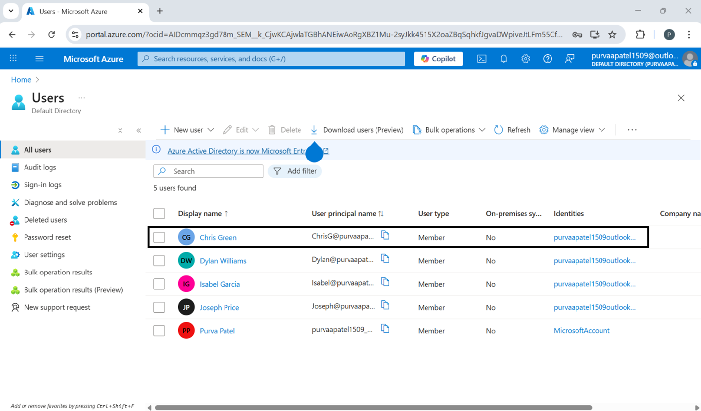](screenshots/entra-user-created.png)

### Step 2 – First Login & MFA Setup

On first login, Chris was required to update the password and register Microsoft Authenticator as the default sign-in method. From the start, the organization enforced that access would not be granted without verification.

[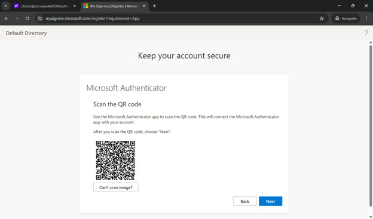](screenshots/entra-mfa-qr.png)
[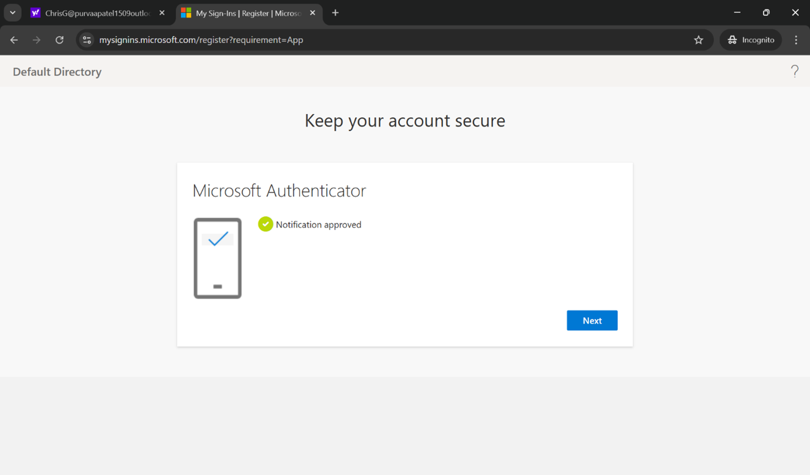](screenshots/entra-mfa-approved.png)
[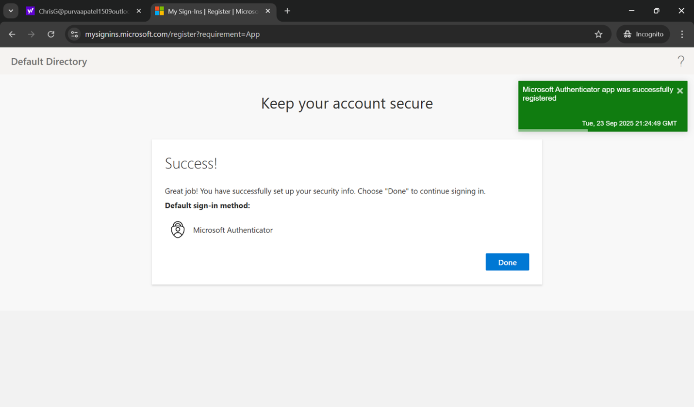](screenshots/entra-mfa-success.png)

### Step 3 – Test Access Without a Role

Chris attempted to create an enterprise application. The option was grayed out. The system did not block with an error, it simply did not show what was not allowed. That is how role-based access works in practice.

[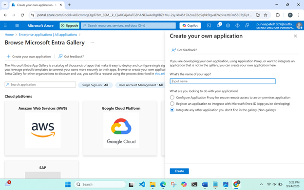](screenshots/entra-no-role-access.png)

### Step 4 – Assign Application Administrator Role

The Application Administrator role was assigned to Chris from the Global Administrator account. Nothing about the user changed. Only the role did.

[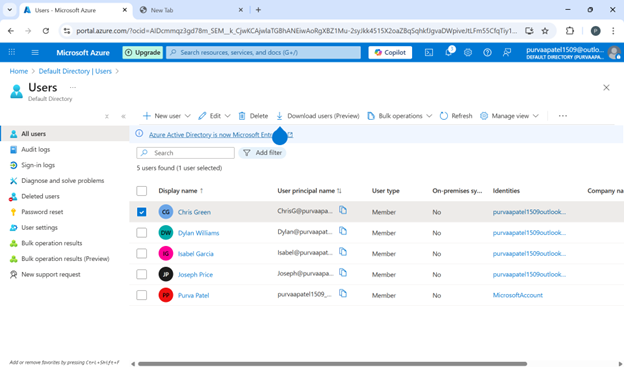](screenshots/entra-role-assigned.png)

### Step 5 – Test Access With Role

Logging back in as Chris, the same option that was unavailable minutes ago was now accessible. That is the principle at the heart of identity management.

[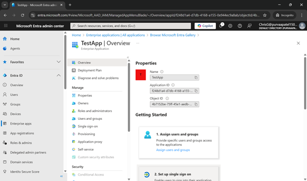](screenshots/entra-role-access-confirmed.png)

### Step 6 – Remove Role Assignment

The role was removed through the Roles and Administrators panel, confirming that access can be revoked just as cleanly as it was granted.

[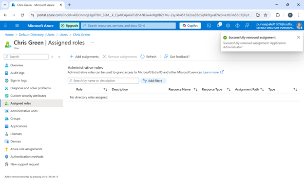](screenshots/entra-role-removed.png)

---

## 🐧 Part 2 – Linux Access Control Models

Before cloud platforms and identity providers, access control started with files, users, and permissions. This part implements six access control models, each designed to solve a different problem.

### Step 1 – Discretionary Access Control (DAC)

Alice created a file. By default only she could read it. Bob was denied. Alice chose to share it and Bob could then read it, but not write to it. The owner decides. That discretion is both the strength and the weakness of this model.

[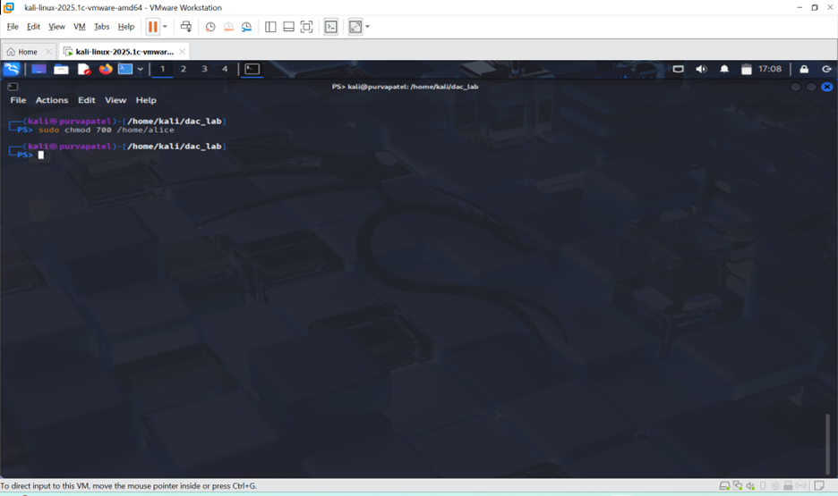](screenshots/dac-permissions.png)
[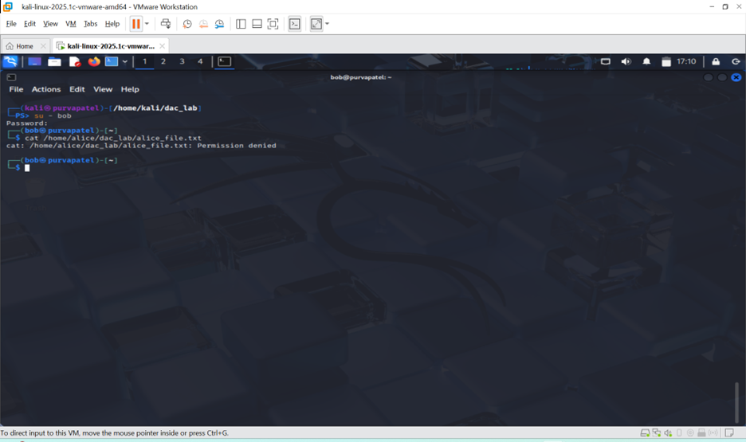](screenshots/dac-bob-denied.png)
[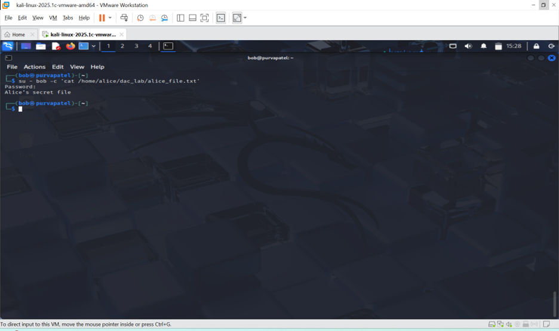](screenshots/dac-bob-read.png)

### Step 2 – Mandatory Access Control (MAC)

An immutable flag was applied to Alice's file as root. Even as the file owner, Alice could not delete or modify it. The policy came from above the owner. This is how high-security systems ensure that even privileged users cannot tamper with critical data.

[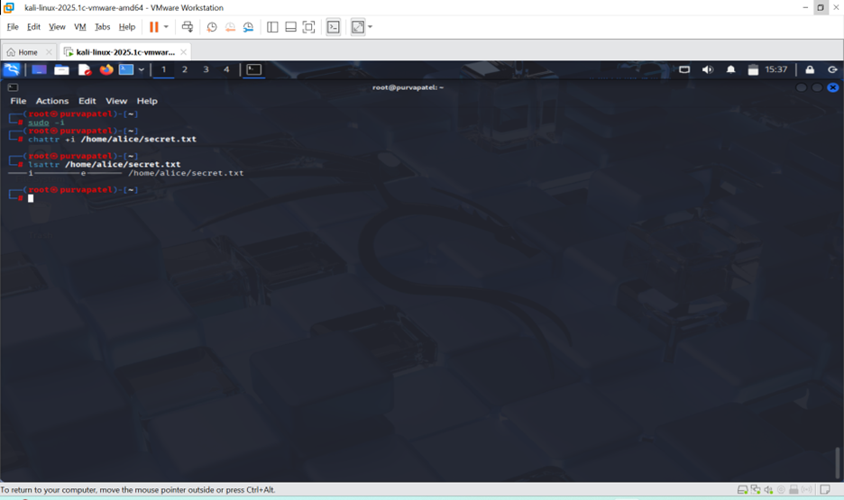](screenshots/mac-chattr.png)
[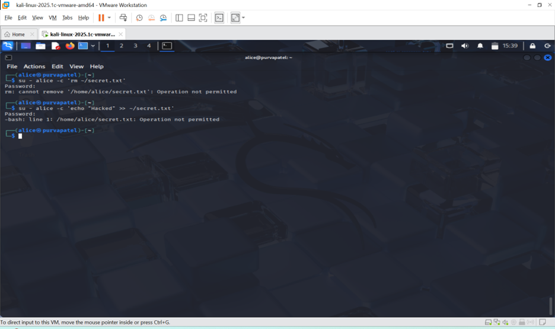](screenshots/mac-denied.png)

### Step 3 – Bell-LaPadula Model

Alice held Top Secret clearance. Bob held Confidential. Bob could not read what Alice could read. Alice could not write data down to Bob's level. Confidentiality flows in one direction only, and the model enforces it structurally.

### Step 4 – Biba Integrity Model

Bob's data was low integrity. Alice's was high integrity. Bob could not write up into Alice's space and corrupt it. Alice could not read down from Bob's space and be influenced by untrusted data. High quality data stays high quality.

### Step 5 – Clark-Wilson Model

A bank account file sat in a secure directory. The only way to change the balance was through a trusted script called a Transformation Procedure. Direct edits were blocked. Data could only change through a certified, controlled process, exactly how financial systems are designed to work.

### Step 6 – Chinese Wall Model

Alice read sensitive data from Bank A. The moment she did, the system recorded that access. When she tried to read data from Bank B, a direct competitor, she was denied. The wall goes up the moment the first access happens.

---

## 🔗 Part 3 – Federated Identity with Google

Organizations rarely exist in isolation. Vendors and partners need access but creating full internal accounts for every external person creates its own security risks. Federated identity solves this by allowing external users to bring their own identity.

### Step 1 – Create Google OAuth App

A new project named MyB2BApp was created in Google APIs Console and configured as an OAuth web application with an external audience.

### Step 2 – Configure Redirect URIs

The Microsoft tenant ID and primary domain were used to register three redirect URIs, telling Google exactly where to send users after authentication.

### Step 3 – Register Client Credentials

The Client ID and Client Secret were copied from the Google OAuth client to be used in Entra ID.

### Step 4 – Configure Google as Identity Provider in Entra ID

The credentials were entered into the External Identities configuration in Microsoft Entra ID. At that point, Google became a recognized identity provider for the tenant.

### Step 5 – Invite External Guest User

The Gmail account was invited as a guest user through Entra ID.

### Step 6 – Accept Invitation & Login with Google

The user accepted the invitation, authenticated through Google, and landed inside the Microsoft environment. No separate Microsoft password. No duplicate account. Their Google identity was the key.

---

## 🔑 Part 4 – Okta: Users, Groups & RBAC

Not every organization runs on Microsoft. Okta is one of the most widely deployed identity platforms in the industry, and this part builds an access control system inside it from the ground up.

### Step 1 – Create Groups

Two groups were created first: Students and Professors. Before any user was added, the structure of access was decided. In a well-designed IAM system, permissions belong to roles, not to individuals.

### Step 2 – Create Users

Alice Student joined the Students group. Bob Professor joined the Professors group with temporary passwords assigned for first login.

### Step 3 – Assign Admin Role

Bob was assigned the Group Administrator role. Alice remained a standard user. The difference became visible immediately during test logins.

### Step 4 – Test Logins

Alice's dashboard was limited. Bob's showed the Admin Console option, giving him access to settings and group management that Alice simply did not have.

### Step 5 – Enable MFA for Professors

MFA was enforced specifically for the Professors group. Administrators carry more risk, so they require stronger verification. Bob was required to set up a second factor. Alice was not.

### Step 6 – Create Library System App

The Library System application was restricted to the Professors group. Bob could see it. Alice could not. Same platform, same login page, completely different experience, determined entirely by group membership.

### Step 7 – Create Student Portal App

The Student Portal was restricted to the Students group. Alice could see it. Bob could not.

---

## 🌐 Part 5 – Okta: SSO, IDaaS, PAM & Auditing

This final part brings everything together and pushes it further into the patterns that define how modern enterprises manage identity at scale.

### Step 1 – Create Research Database App (SSO)

A third application, Research Database, was created using SAML 2.0 and assigned to both groups. This introduced Single Sign-On across multiple applications.

### Step 2 – Test SSO as Student User

Alice logged into Okta and clicked Research Database. She was redirected immediately with no second login and no second password. Her Okta session carried her through. One authentication. Multiple applications.

### Step 3 – Test SSO as Professor User

Bob's session worked the same way. The login crossed application boundaries without friction, exactly as SSO is designed to work.

### Step 4 – Add Cloud Application (IDaaS)

Google Workspace was added from Okta's Integration Network and assigned to both groups as Cloud Collaboration Tool. Both users could click into it from their dashboards and be passed through automatically. The session followed them into the cloud.

### Step 5 – Privileged Access Management

A dedicated sign-on policy was applied to the Professors group requiring MFA at every login and blocking access from outside North America. The security weight was placed exactly where the risk was. Bob faced these controls every time. Alice did not.

### Step 6 – Auditing & Monitoring

The Okta System Log was reviewed. Every login, every MFA challenge, every admin action, all of it recorded with timestamps and event types. In a real environment this log feeds into a SIEM. Auditing is not the last step in identity management. It is what makes everything else accountable.

---

## ✅ Final Summary

This project covers the full spectrum of identity and access management, from foundational access control theory on Linux to enterprise-grade platforms used in production environments today.

| Area | What Was Implemented |
|---|---|
| User Lifecycle | Created, assigned roles, and removed roles in Entra ID |
| Access Control Models | DAC, MAC, Bell-LaPadula, Biba, Clark-Wilson, Chinese Wall |
| Federated Identity | Google OAuth B2B federation with Microsoft Entra ID |
| RBAC | Group-based app access in Okta |
| SSO | SAML 2.0 single sign-on across multiple applications |
| IDaaS | Okta as Identity Provider for cloud app integration |
| PAM | Admin role assignment with enforced MFA and geo-restrictions |
| Auditing | System log review for login, MFA, and admin events |